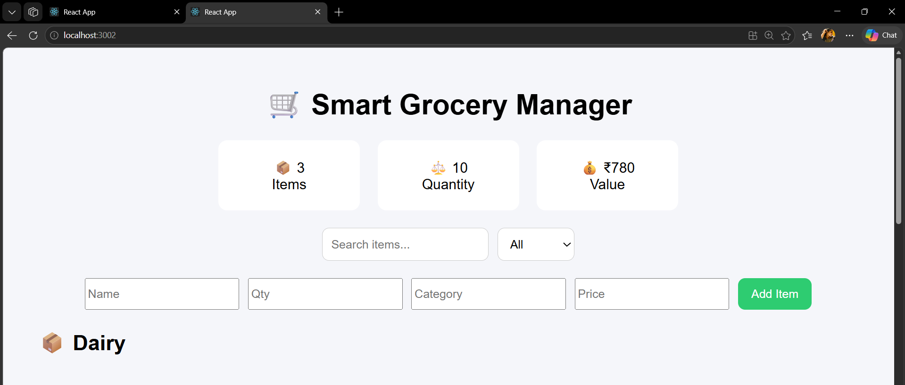
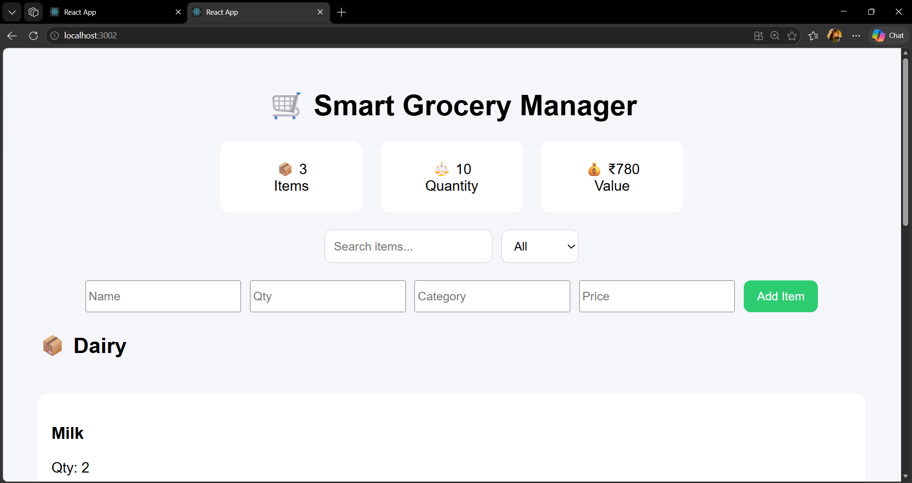
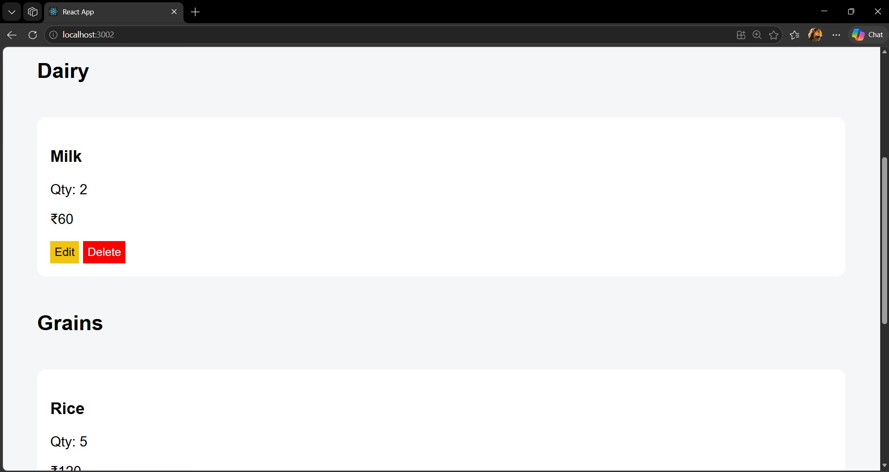
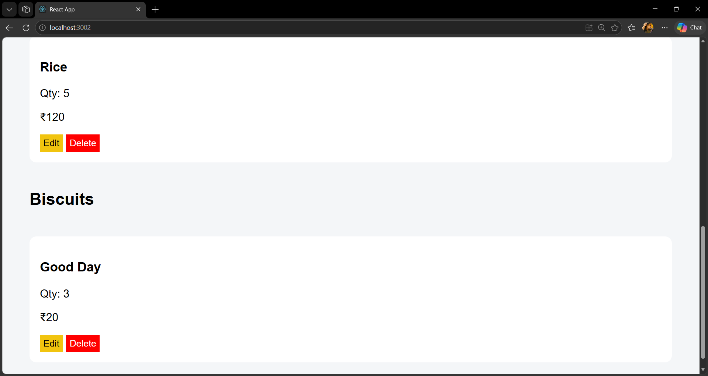
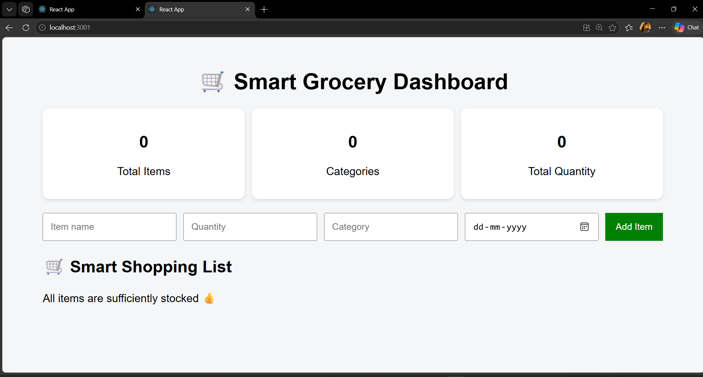

# 🛒 Smart Grocery List & Inventory Manager

## 📌 Project Overview
The Smart Grocery List & Inventory Manager is a full-stack web application designed to help users efficiently manage grocery inventory, track stock levels, categorize items, and calculate total inventory value.

This project simulates real-world inventory systems used in households, hostels, cloud kitchens, and small retail environments.

## 🎯 Problem Statement
People often forget available groceries at home, buy duplicate items, waste food due to expiry or poor tracking, and lack a structured grocery management system. This application solves these issues by providing a smart digital inventory dashboard.

## ✨ Features

### 🧾 Core Features
- Add grocery items (name, quantity, category, price)
- Edit and delete items
- Category-wise grouping
- Search functionality
- Filter by category

### 📊 Dashboard Features
- Total number of items
- Total quantity tracker
- Total inventory value
- Clean UI dashboard cards

### 🧠 Smart Features
- Local storage persistence (data saved in browser)
- Real-time UI updates
- Responsive design
- Organized category-based inventory view

## 🛠 Tech Stack

### Frontend
- React.js
- JavaScript (ES6+)
- CSS (Inline styling)

### Backend (Future Upgrade)
- Node.js
- Express.js
- MongoDB

## 📁 Project Structure
Smart-Grocery-Inventory-Manager/
├── client/
│   ├── src/
│   │   ├── App.js
│   │   ├── App.css
│   │   └── index.js
├── server/
│   ├── server.js
└── README.md

## 🚀 How to Run Locally

### 1️⃣ Clone Repository
git clone <your-repo-url>

### 2️⃣ Install Dependencies
cd client  
npm install  

### 3️⃣ Start Frontend
npm start  

## 🌐 Deployment
- Frontend: Vercel / Netlify  
- Backend: Render (optional future upgrade)  
- Database: MongoDB Atlas (future upgrade)

## 📸 Screenshots / Outputs

Dashboard Preview:

  
  
  
  

## 📚 Learning Outcomes
- React state management
- CRUD operations in frontend
- Component-based architecture
- Filtering and grouping data
- UI/UX dashboard design
- Real-world inventory system logic
- Git & GitHub project structuring

## 👨‍💻 Author
S.Hemalatha
Built by a student as a Full Stack Development portfolio project.

## 🚀 Future Enhancements
- JWT authentication (login system)
- MongoDB integration
- Barcode scanning feature
- Analytics charts (Recharts)
- Multi-user shared inventory system

## 🏁 Conclusion
This project demonstrates a real-world grocery inventory system with smart UI, dynamic updates, and scalable architecture. It is suitable for portfolio, internship, and academic submission.